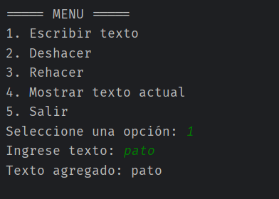
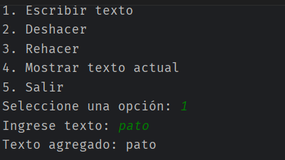
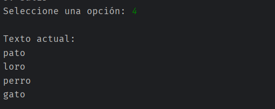
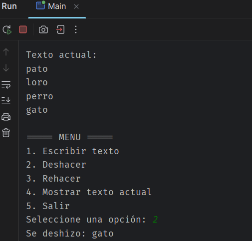
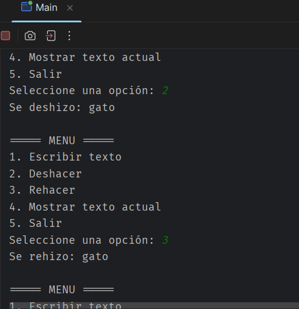

# 📝 Simulador Undo/Redo - Editor de Texto Simple

**Autor:** Diego Fernando Daza Ijaji  
**Asignatura:** Estructuras de Datos  
**Institución:** IU Digital Antioquia  
**Fecha:** Marzo 2025

---

##  Objetivo del Proyecto

El objetivo de esta actividad es que el estudiante comprenda el **concepto de pila (Stack)** y su estructura, y que sea capaz de aplicarlo en un **simulador de deshacer/rehacer (Undo/Redo)** en un editor de texto simple, implementado en **Java**. 

A través de este proyecto se busca:
-  Dominar la estructura de datos **pila (Stack)** con el principio **LIFO** (Last In First Out)
-  Implementar funcionalidades de **Undo y Redo** usando dos pilas independientes
-  Trabajar en equipo siguiendo buenas prácticas de control de versiones con **GitHub**
-  Desarrollar aplicaciones de consola robustas en Java

---

##  Instrucciones de Ejecución

### Requisitos Previos
- **Java JDK 11** o superior instalado
- **IntelliJ IDEA** (recomendado) o cualquier IDE compatible con Java
- **Git** instalado para control de versiones

### Pasos para Ejecutar

1. **Clonar el repositorio** (si está en GitHub):
   ```bash
   git clone <URL-del-repositorio>
   cd Actividada\ 1.2
   ```

2. **Abrir el proyecto en IntelliJ IDEA**:
   - Abre IntelliJ IDEA
   - File → Open → Selecciona la carpeta del proyecto
   - Espera a que IntelliJ indexe los archivos

3. **Compilar el proyecto**:
   - Click derecho en la carpeta `src/`
   - Selecciona "Compile 'Actividada 1.2'"

4. **Ejecutar la aplicación**:
   - Abre el archivo `Main.java`
   - Presiona `Ctrl + Shift + F10` (o haz click en el botón Play verde)
   - La aplicación se abrirá en la consola

### Uso de la Aplicación

Una vez ejecutada, verás el siguiente menú:

```
===== MENU =====
1. Escribir texto
2. Deshacer
3. Rehacer
4. Mostrar texto actual
5. Salir

Seleccione una opción:
```

**Opciones disponibles:**
- **Opción 1:** Escribe nuevo texto que se agrega a la pila de acciones
- **Opción 2:** Deshace la última acción (mueve el texto a la pila de deshacer)
- **Opción 3:** Rehace la última acción deshecha (mueve el texto a la pila de acciones)
- **Opción 4:** Muestra el contenido actual del editor
- **Opción 5:** Sale de la aplicación

---

## 📁 Estructura del Proyecto

```
Actividada 1.2/
├── src/
│   ├── Main.java           # Clase principal con el menú interactivo
│   ├── EditorTexto.java    # Clase que maneja Undo/Redo usando pilas
│   └── Stack.java          # Implementación personalizada de la estructura pila
├── .gitignore              # Archivos ignorados por Git
├── Actividada 1.2.iml      # Configuración del proyecto IntelliJ
└── README.md               # Este archivo
```

### Descripción de Clases

#### 📄 `Stack.java`
Implementación de la estructura de datos **Pila (Stack)** usando `ArrayList`.

**Métodos principales:**
- `push(String value)` - Agrega un elemento a la pila
- `pop()` - Elimina y retorna el último elemento (LIFO)
- `peek()` - Retorna el último elemento sin eliminarlo
- `isEmpty()` - Verifica si la pila está vacía
- `size()` - Retorna la cantidad de elementos

#### 📄 `EditorTexto.java`
Clase que implementa la lógica del editor con funcionalidades Undo/Redo.

**Atributos:**
- `pilaAcciones` - Almacena los textos escritos
- `pilaDeshacer` - Almacena los textos deshechos

**Métodos principales:**
- `escribirTexto(String texto)` - Agrega texto nuevo
- `deshacer()` - Deshace la última acción
- `rehacer()` - Rehace la última acción deshecha
- `mostrarTexto()` - Muestra el contenido actual

#### 📄 `Main.java`
Clase principal que proporciona la interfaz de usuario mediante menú en consola.

Gestiona la interacción con el usuario y controla el flujo del programa.

---

## 📸 Capturas de Pantalla de la Ejecución

### Pantalla 1: Menú Principal


### Pantalla 2: Escribir Texto


### Pantalla 3: Mostrar Texto Actual


### Pantalla 4: Deshacer Acción


### Pantalla 5: Rehacer Acción


---

## Conceptos Clave Implementados

### Estructura de Datos: Pila (Stack)
Una **pila** es una estructura de datos que sigue el principio **LIFO** (Last In, First Out):
- El último elemento en entrar es el primero en salir
- Similar a una pila de platos: agregas platos por arriba y los sacas por arriba

### Casos de Uso: Undo/Redo
- **Undo (Deshacer):** Retira el último elemento de la pila de acciones y lo agrega a la pila de deshacer
- **Redo (Rehacer):** Retira el elemento de la pila de deshacer y lo vuelve a agregar a la pila de acciones

### Ventajas de esta Estructura
 Eficiencia: Operaciones O(1) para push, pop y peek  
 Simplicidad: Fácil de entender e implementar  
 Aplicabilidad: Usada en navegadores, editores de texto, compiladores, etc.

---


##  Aprendizajes Principales

Al completar este proyecto, el estudiante habrá aprendido:

1.  Implementación de pilas desde cero
2.  Aplicación práctica de estructuras de datos
3.  Patrones de diseño (como el patrón de Command con Undo/Redo)
4.  Buenas prácticas de programación en Java
5.  Uso de control de versiones con Git y GitHub
6.  Desarrollo de interfaces de usuario en consola

---


---

##  Autor

**Diego Fernando Daza Ijaji**  
IU Digital Antioquia  
10 de Marzo 2026

---


